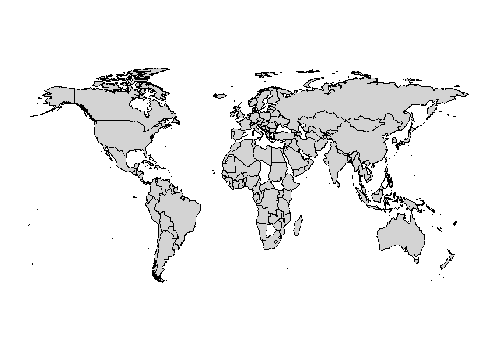
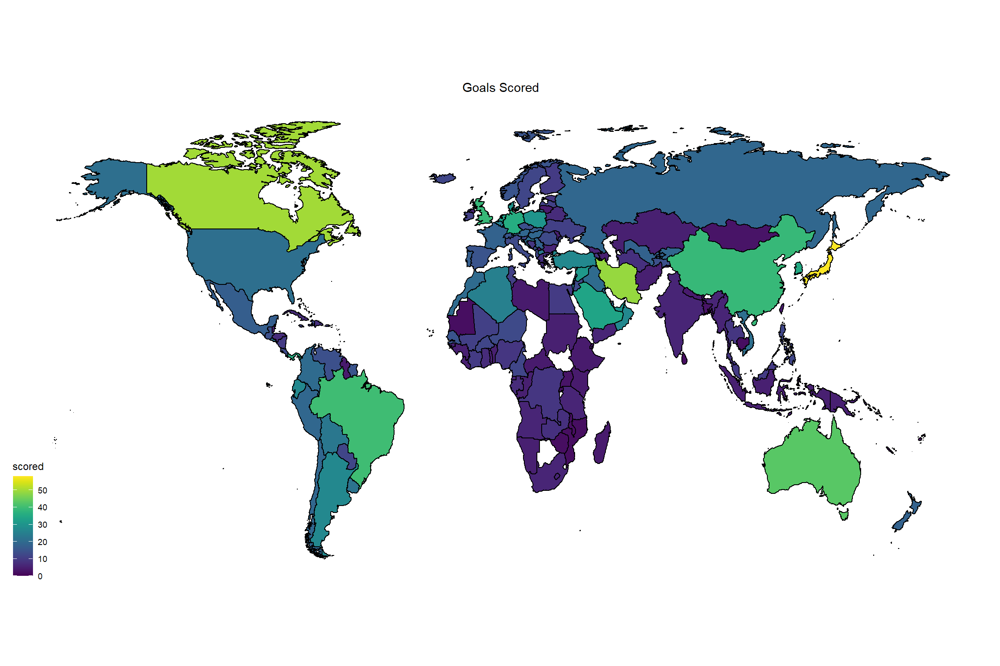
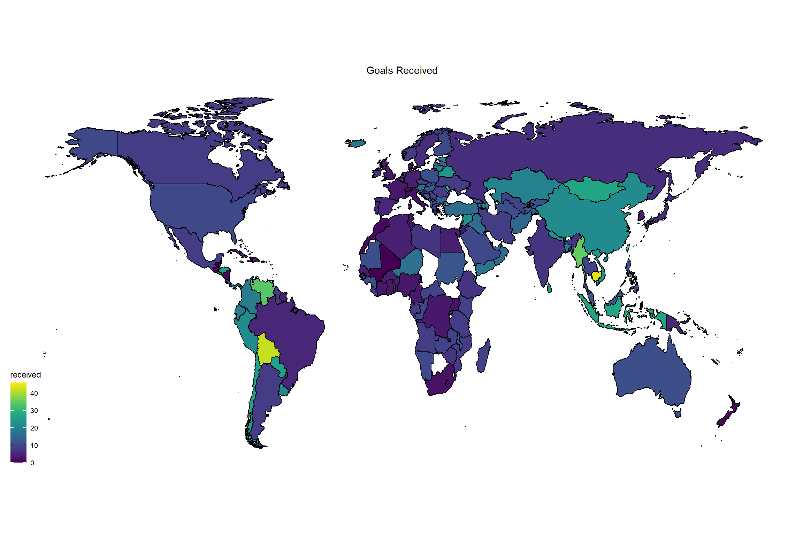
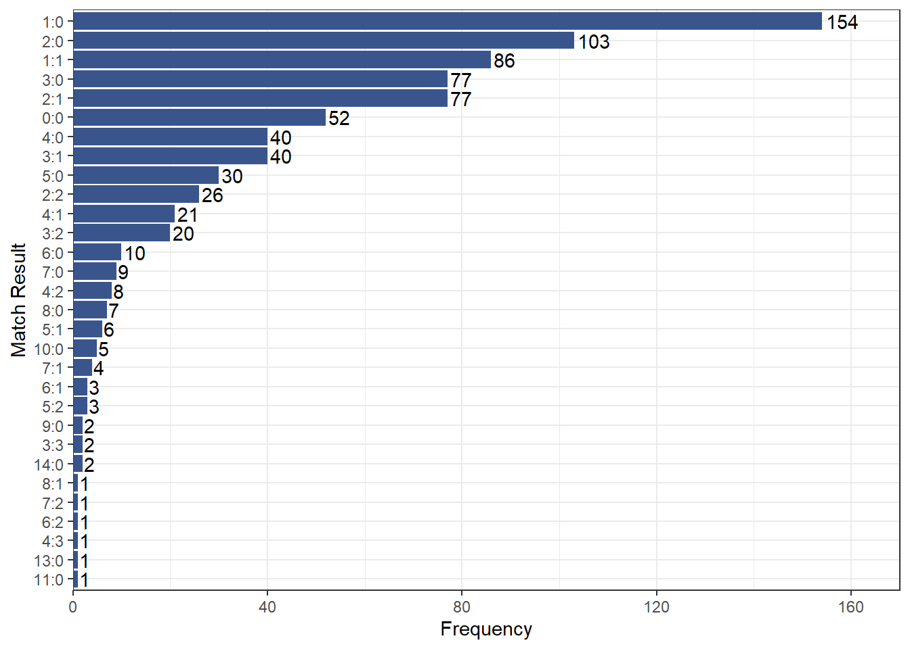

With this series of blog posts, I wanted to learn more about `Python`, plotting maps with `ggplot`, modeling with `STAN`, football (?) and just practice writing. The aim is to predict the games of the 2022 football world championship using data from the qualifying games of all countries and informations about the individual players of each team. I scraped the data from open websites using `Python`. The scripts can be found on the corresponding `Github` page of this project. In this first blog post of the series, I want to explore the data set `results_quali_matches.csv` which contains the data of all qualifying games. I never used spatial data or plotted spatial data, so since I have data from all over the world, I want to try out plotting maps with `ggplot`. The main point of this blog post, however, is to get a feel for the data we have, which will be useful for our modeling attempts later. 

# Exploring the goals around the world.

I start by loading the packages I need, set a general theme for our plots, and then load our data. 

::: {.cell}

```{.r .cell-code}
library(tidyverse)
library(maps)
library(mapdata)
library(viridis)
library(patchwork)
library(countrycode)
library(ggthemes)
library(ggrepel)
library(plotly)

theme_set(
  theme_bw() +
    theme(plot.title = element_text(hjust = 0.5)) 
)


quali22        <- read_csv2("../../data/results_quali_matches.csv")
quali22$goalsA <- as.numeric(quali22$goalsA)
```
:::

In total we have 796 matches in our data set. Lets also check how many different countries we have:

::: {.cell}

```{.r .cell-code}
countries <-  quali22$teamA %>% unique() 
length(countries)
```

::: {.cell-output .cell-output-stdout}
```
[1] 183
```
:::
:::

# Exploring the goals around the world.

Lets start by calculating and plotting the number of goals scored and received by each country. Our data.frame generally looks like this:

::: {.cell}

```{.r .cell-code}
head(quali22)
```

::: {.cell-output .cell-output-stdout}
```
# A tibble: 6 × 5
  teamA        teamB        goalsA goalsB region
  <chr>        <chr>         <dbl>  <dbl> <chr> 
1 Niger        Burkina Faso      0      2 Africa
2 Algerien     Djibouti          8      0 Africa
3 Djibouti     Niger             2      4 Africa
4 Burkina Faso Algerien          1      1 Africa
5 Algerien     Niger             6      1 Africa
6 Djibouti     Burkina Faso      0      4 Africa
```
:::
:::

I first want to create two new variables `scored` and `received` using a `for`-loop. There might be a "tidyverse" way to do this faster, however, I think the `for`-loop is pretty straight forward.

::: {.cell}

```{.r .cell-code}
n_countries <- length(countries)
scored      <- vector("numeric",n_countries)
received    <- vector("numeric",n_countries)

for(i in 1:length(countries)){

  country <- countries[i]
  rows    <- quali22 %>% filter(teamA == country | teamB == country) 

  temp    <- rows %>% mutate(scored  = case_when(
                                        teamA == country ~ goalsA,
                                        teamB == country ~ goalsB),
                            received = case_when(
                                        teamA == country ~ goalsB,
                                        teamB == country ~ goalsA)) %>%
                      summarize(scored   = sum(scored,na.rm=TRUE),
                                received = sum(received,na.rm=TRUE))

  scored[i]   <- temp$scored
  received[i] <- temp$received
}
```
:::

Lets combine all variables to a new data.frame:

::: {.cell}

```{.r .cell-code}
country_stats <- tibble("country" = countries,scored,received) %>%
                    arrange(desc(scored))
country_stats
```

::: {.cell-output .cell-output-stdout}
```
# A tibble: 183 × 3
   country     scored received
   <chr>        <dbl>    <dbl>
 1 Japan           58        6
 2 Kanada          50        8
 3 Iran            49        8
 4 Australien      43       11
 5 Brasilien       40        5
 6 China           39       22
 7 England         39        3
 8 Panama          36       20
 9 Deutschland     36        4
10 Südkorea        35        4
# … with 173 more rows
```
:::
:::


## Making world maps using the ggplot2

Now I want to make a  world map and then color each country by the number of goals scored/received. For this I will use the `map` package, which provides a data.frame that  contains outlines of several continents.

::: {.cell}

```{.r .cell-code}
world <- map_data("world")

head(world)
```

::: {.cell-output .cell-output-stdout}
```
       long      lat group order region subregion
1 -69.89912 12.45200     1     1  Aruba      <NA>
2 -69.89571 12.42300     1     2  Aruba      <NA>
3 -69.94219 12.43853     1     3  Aruba      <NA>
4 -70.00415 12.50049     1     4  Aruba      <NA>
5 -70.06612 12.54697     1     5  Aruba      <NA>
6 -70.05088 12.59707     1     6  Aruba      <NA>
```
:::
:::

This  `world` data.frame has the following variables: `long` for longitude, `lat` for latitude, `group` tells which adjacent points to connect, `order` refers to the sequence by which the points should be connected, and `region` and `subregion` annotate the area surrounded by a set of points. We can use this information to plot the world using `ggplot`: 

::: {.cell}

```{.r .cell-code}
ggplot(data = world, aes(x=long, y = lat, group = group)) +
  geom_polygon(color="black",fill="lightgrey")  +
  coord_fixed(1.3) + theme_map() # looks better
```

::: {.cell-output-display}
{width=672}
:::
:::

Beautiful, isn't it ? In order to color each country by the number of goals scored or received, we have to join the `world` and the `country_stats` data.frames together. However, before we can do this, we first have to make some processing steps in both data.frames. First, I need to translate the country names in the `country_stats` data.frames from German to English, since the `region` column in `world` contains the Names in English. Second, in the `country_stats` data.frame I have some "countries" which are rather sub-regions in `world`, for instance, Wales or Scotland. Thus, I need to create a new column in `world` which contains the same "countries" as in `country_stats`. 
 
To translate the names, I use the `countrycode` package. 

::: {.cell}

```{.r .cell-code}
country_stats <- country_stats %>%
                    mutate(country_en = countrycode(country, origin      = 'country.name.de',
                                                             destination = 'country.name.en'))
country_stats %>% head()
```

::: {.cell-output .cell-output-stdout}
```
# A tibble: 6 × 4
  country    scored received country_en
  <chr>       <dbl>    <dbl> <chr>     
1 Japan          58        6 Japan     
2 Kanada         50        8 Canada    
3 Iran           49        8 Iran      
4 Australien     43       11 Australia 
5 Brasilien      40        5 Brazil    
6 China          39       22 China     
```
:::
:::

This worked quite well, except for the following warning: `Some values were not matched unambiguously: Br. Jungferninseln, Djibouti, Dom. Republik, England,` `Kapverdische Inseln, Schottland, Sénégal, VA Emirate, Wales, Zentralafr. Republik`. So I still have to put in some work by myself. I also added additional country name changes, based on checks a few code chunks further down.

::: {.cell}

```{.r .cell-code}
country_stats <- country_stats %>%
                    mutate(country_en = case_when(
                      country == "Djibouti" ~ "Djibouti", # not sure why this didnt work before
                      country == "Br. Jungferninseln" ~ "Virgin Islands",
                      country == "Dom. Republik" ~ "Dominican Republic",
                      country == "England" ~ "Great Britain",
                      country == "Kapverdische Inseln" ~ "Cape Verde",
                      country == "Schottland" ~ "Scotland",
                      country == "Sénégal" ~ "Senegal",
                      country == "Wales" ~ "Wales",
                      country == "Zentralafr. Republik" ~ "Central African Republic",
                      country == "Bosnien-Herzegowina" ~ "Bosnia and Herzegovina",
                      country == "Elfenbeinküste" ~ "Ivory Coast",
                      country == "Tschechien" ~ "Czech Republic",
                      country == "Curaçao" ~ "Curacao",
                      country == "Kongo" ~ "Republic of Congo",
                      country == "USA" ~ "USA",
                      country == "DR Kongo" ~ "Democratic Republic of the Congo",
                      country == "St. Kitts & Nevis" ~ "Nevis",
                      country == "Antigua & Barbuda" ~ "Antigua",
                      country == "Turks & Caicos" ~ "Turks and Caicos Islands",
                      country == "Trinidad & Tobago" ~ "Trinidad",
                      country == "St. Vincent/Grenadines" ~ "Saint Vincent",
                      country == "VA Emirate" ~ "United Arab Emirates",
                      country == "Hong Kong SAR China" ~ "Hongkong",
                      country == "Palästina" ~ "Palestine",
                      country == "Myanmar" ~ "Myanmar",
                      country == "Nordirland" ~ "Northern Ireland",
                      TRUE ~ country_en
                    )) 
 


# check if we have everything:
# country_stats %>% filter(is.na(country_en))
country_stats %>% head()
```

::: {.cell-output .cell-output-stdout}
```
# A tibble: 6 × 4
  country    scored received country_en
  <chr>       <dbl>    <dbl> <chr>     
1 Japan          58        6 Japan     
2 Kanada         50        8 Canada    
3 Iran           49        8 Iran      
4 Australien     43       11 Australia 
5 Brasilien      40        5 Brazil    
6 China          39       22 China     
```
:::
:::

Next I make a new variable in the `worlds` data.frame, which I will then use to join both data.frames together.

::: {.cell}

```{.r .cell-code}
world <- world %>%
            mutate(country_en = case_when(subregion == "Wales" ~ "Wales",
                                          subregion == "Northern Ireland" ~ "Northern Ireland",
                                          subregion == "Scotland" ~ "Scotland",
                                          subregion == "Great Britain" ~ "Great Britain",
                                          subregion == "Grand Caicos Island" ~ "Turks and Caicos Islands",
                                          subregion == "British" ~ "Virgin Islands",
                                          subregion == "Hong Kong" ~ "Hong Kong",
                                          TRUE ~ region)) %>% 
            filter(region != "USA" | region == "USA" & (is.na(subregion) | subregion == "Alaska"),
                   region != "United Arab Emirates" | region == "United Arab Emirates" & is.na(subregion),
                   region != "Myanmar" | region == "Myanmar" & is.na(subregion),
                   region != "Ireland" | region == "Ireland" & is.na(subregion))
  
# We need to add Gibraltar through a different dataset
# "worldHires" is a more detailed version of "world"
temp <- map_data('worldHires')  %>% filter(subregion == "Gibralter") %>% mutate(country_en = "Gibraltar")
  

world <- bind_rows(world,temp) %>% as_tibble() 
```
:::

Now we can join both data.frames using `left_join`. Lets also clean the resulting data.frame a little bit.

::: {.cell}

```{.r .cell-code}
country_stats <- left_join(country_stats,world,by="country_en") %>% 
                      select(region = country_en, scored, received, long, lat, group, order )

# checks:
# check if any countries do not have infos from world
# country_stats %>% filter(is.na(long)) %>% pull(region) %>% unique()
```
:::

Great, after some back and forth changes, I think I now have the position of every country in our data set. Lets check this, by just plotting all countries or regions where we have some data from.

::: {.cell}

```{.r .cell-code}
ggplot(data = country_stats, aes(x=long, y = lat, group = group)) +
  geom_polygon(color="black",fill="lightgrey") +
  coord_fixed(1.3) + theme_map()
```

::: {.cell-output-display}
{width=672}
:::
:::

So we this really is a "World" championship. 

## Color regions by goals scored and recevied

Here I color each country or region by the number of goals they scored and received in their qualifying matches. From the plots you can identify some countries which apparently did well in their group, since the score many goals, but received only few. For instance, Canada, Japan, German, or Brasil. There also seem to be fewer goals in African and south-east Asian countries.

::: {.cell}

```{.r .cell-code}
ggplot(data = country_stats, aes(x=long, y = lat, group = group)) +
  geom_polygon(aes(fill=scored), color="black",size = 0.5) + 
  scale_fill_viridis() +
  coord_fixed(1.3) +
  labs(title = "Goals Scored") + theme_map() +
  theme(plot.title = element_text(hjust = 0.5)) 
```

::: {.cell-output-display}
{width=1152}
:::

```{.r .cell-code}
ggplot(data = country_stats, aes(x=long, y = lat, group = group)) +
  geom_polygon(aes(fill=received), color="black",size = 0.5) + 
  scale_fill_viridis() +
  coord_fixed(1.3) +
  labs(title = "Goals Received") + theme_map() +
  theme(plot.title = element_text(hjust = 0.5)) 
```

::: {.cell-output-display}
{width=1152}
:::
:::


::: {.cell}

```{.r .cell-code}
# p1 <- ggplot(data = country_stats, aes(x=long, y = lat, group = group)) +
#   geom_polygon(aes(fill=scored), color="black",size = 0.5) +
#   scale_fill_viridis() +
#   labs(title = "Goals Scored") + theme_map() +
#   theme(plot.title = element_text(hjust = 0.5))
# 
# p2 <- ggplot(data = country_stats, aes(x=long, y = lat, group = group)) +
#   geom_polygon(aes(fill=received), color="black",size = 0.5) +
#   scale_fill_viridis() +
#   labs(title = "Goals Received") + theme_map() +
#   theme(plot.title = element_text(hjust = 0.5))
# 
# 
# p1 / p2
# 
# 
# ggsave("goals_WM22_qualifying.svg",width=30,height=30,unit="cm")
```
:::


## Goals Scored and Received per Country

::: {.cell}

```{.r .cell-code}
temp <- country_stats %>% select(region,scored,received) %>% distinct()
```
:::


I also want to get a general idea of the distribution and relationship of the scored and received goals. There is only a small negative correlation between the number of goals scored and the number of goals received (r = -0.16), mostly driven by Japan.

::: {.cell}

```{.r .cell-code}
p_scatter <- ggplot(temp,aes(x = scored, y = received)) +
              geom_point(shape = 21, fill = "lightgrey",size = 2) +
              geom_smooth(method = "lm") +
              geom_label_repel(aes(label = region),
                               box.padding   = 0.35, 
                               point.padding = 0.5,
                               segment.color = 'grey50')

p_scatter
```

::: {.cell-output-display}
{width=672}
:::
:::


On average, countries scored/received 12.43 goals (SD = 10.53). Lets also look at the distributions:

::: {.cell}

```{.r .cell-code}
ggplot(temp) + 
  geom_density(aes(x = scored, fill = "Scored"), alpha = 0.5) +
  geom_density(aes(x = received, fill = "Received"), alpha = 0.5) +
  scale_fill_manual(values = c("#74D055FF","#39558CFF")) + 
  labs(fill = "Goals",x = "", y="", title = "Distribution of Goals per Country") +
  theme(legend.position = c(0.8, 0.8)) +
    scale_x_continuous(expand = c(0, 0), limits = c(0, 65)) + 
    scale_y_continuous(expand = c(0, 0), limits = c(0, 0.065))
```

::: {.cell-output-display}
{width=672}
:::
:::

## Goals Scored and Received per match

I am also interested in the single match-ups, for instance, how many goals are there in the average match, what are the most probably outcomes of a match, etc. Lets try to find this out. On average, there were  1.43 goals per game (SD = 1.72). The distribution of goals looks as follows:


::: {.cell}

```{.r .cell-code}
data.frame(goals = c(quali22$goalsA,quali22$goalsB)) %>%
  count(goals,sort=T) %>%
  na.omit() %>% 
  ggplot(aes(x = goals,y = n)) + 
    geom_col(fill="#39558CFF") +
    geom_text(aes(label = n), vjust = -0.3) +
    ylim(0,560) +
    labs(x = "Nr. of Goals of one team", y="Frequency", title = "Distribution of Goals per Match") 
```

::: {.cell-output-display}
{width=672}
:::
:::

The most common number of goals a team scores is 0 (sad). Now lets look at the results of the matches. I don't really care if the match was 1:0 or 0:1, so I will treat both outcomes as the same. I will first recode the individual goals of team A and B into a match results variable `result`, which I can then use to count and plot the different results.

::: {.cell}

```{.r .cell-code}
quali22 %>%
  na.omit() %>%
  arrange(goalsA,goalsB) %>% 
  mutate(result = paste0(ifelse(goalsA > goalsB,goalsA,goalsB),
                         ":",
                         ifelse(goalsA > goalsB,goalsB,goalsA))) %>%
  count(result,sort=T) %>% 
  ggplot(aes(x = reorder(result,n),y = n)) +
    geom_col(fill="#39558CFF") +
    geom_text(aes(label = n), hjust = -0.12) +
    coord_flip() +
    scale_y_continuous(expand = c(0, 0), limits = c(0, 170)) +
    labs(x = "Match Result", y = "Frequency")
```

::: {.cell-output-display}
{width=672}
:::
:::
Not suprising, results of 1:0, 2:0, or 1:1 are the most common outcomes. Just out of curioisity, lets check the high scoring games:

::: {.cell}

```{.r .cell-code}
quali22 %>% filter(goalsA >= 10 | goalsB >= 10)
```

::: {.cell-output .cell-output-stdout}
```
# A tibble: 9 × 5
  teamA          teamB                  goalsA goalsB region  
  <chr>          <chr>                   <dbl>  <dbl> <chr>   
1 Iran           Kambodscha                 14      0 Asia    
2 Kambodscha     Iran                        0     10 Asia    
3 Japan          Mongolei                   14      0 Asia    
4 Japan          Myanmar                    10      0 Asia    
5 Kaimaninseln   Kanada                      0     11 CONCACAF
6 Guatemala      St. Vincent/Grenadines     10      0 CONCACAF
7 Anguilla       Panama                      0     13 CONCACAF
8 Turks & Caicos Haiti                       0     10 CONCACAF
9 San Marino     England                     0     10 Europe  
```
:::
:::
Those were some very one-sided match-ups. 